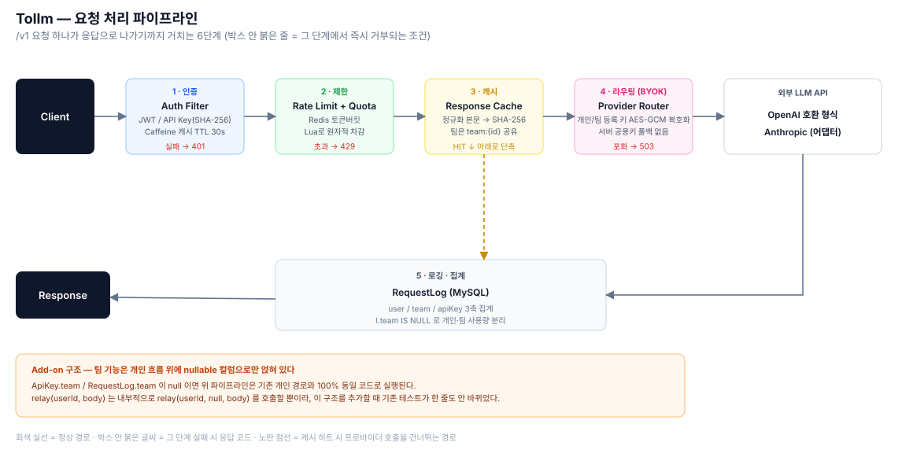

# Tollm — 팀을 위한 AI(LLM) API 게이트웨이

> Toll(통행료) + LLM. 모든 AI 요청이 통과하며 인증·과금·제한이 이루어지는 관문.

여러 LLM 프로바이더(OpenAI 호환 형식·Anthropic)를 하나의 엔드포인트로 묶고, 인증·레이트리밋·쿼터·캐시·사용량 집계까지 처리하는 Spring Boot 게이트웨이입니다. BCSD 회고 프로젝트로 2주간(2026.07.14~07.28) 혼자 설계·구현했습니다.

**[Live Demo](http://15.164.215.213/)** · Java 21 · Spring Boot 3.3.5 · MySQL · Redis

## 구조



## 핵심 설계

- **BYOK (Bring Your Own Key)** — 서버는 프로바이더 API 키를 보관하지 않습니다. 사용자/팀이 각자 등록한 키를 AES-GCM으로 암호화해 저장하고, 요청마다 복호화해 씁니다. 서버 공용 키로의 폴백은 없습니다.
- **Redis Lua 토큰버킷** — 레이트리밋의 "조회 → 계산 → 차감"을 단일 원자 연산으로 묶어, 여러 인스턴스·동시 요청에서도 레이스 컨디션 없이 정확한 한도를 지킵니다.
- **개인 흐름 위의 Add-on** — 팀 기능(쿼터, 캐시, 사용량 집계)은 검증된 개인 사용자 로직에 nullable `team` 컬럼만 얹어 구현했습니다. 개인 키는 항상 `team = null`이라 기존 로직·기존 테스트가 한 줄도 바뀌지 않습니다.
- **응답 캐시** — 요청 본문을 정규화한 뒤 SHA-256으로 캐시 키를 만들어, 형식만 다른 동일 요청의 캐시 미스를 막습니다.

## 로컬 실행

```bash
# MySQL 8: tollm 스키마 생성, Redis: docker run -p 6379:6379 redis
cp deploy/tollm.env.example .env   # 채운 뒤
./gradlew bootRun
```

필수 환경변수: `JWT_SECRET`, `BYOK_ENCRYPTION_KEY`(32자 이상, 한 번 정하면 변경 금지 — 이미 등록된 키를 복호화 못 하게 됨), `DB_*`, `REDIS_HOST`. 값이 비어 있으면 prod 프로파일은 부팅 자체를 실패시킵니다(fail-fast).

## 배포 (EC2)

1. `mysql -u <user> -p tollm < db/schema.sql` — prod는 `ddl-auto=validate`라 스키마 선적용이 먼저입니다.
2. `deploy/tollm.env.example`을 `/etc/tollm/tollm.env`로 복사해 값 채우고 `chmod 600`.
3. `SPRING_PROFILES_ACTIVE=prod`로 기동 → `curl localhost:8080/actuator/health`로 확인.
4. Nginx 리버스 프록시, `proxy_read_timeout`을 앱 read timeout(60s)보다 크게(75s 등).

## 패키지 구조

```
com.tollm
├── domain
│   ├── user        # 회원, 인증 (JWT)
│   ├── team        # 팀, 팀원, 초대 링크
│   ├── apikey      # 게이트웨이 키 발급/관리
│   ├── provider    # LLM 프로바이더, 모델 단가
│   ├── providerkey # BYOK — 개인/팀별 프로바이더 키 암호화 저장
│   ├── proxy       # 프록시 핵심: 레이트리밋, 캐시, 라우팅
│   ├── usage       # 요청 로그, 쿼터, 사용량 조회 (user/team/apiKey 3축)
│   └── admin       # 관리자 통계
└── global
    ├── auth        # JwtProvider, CryptoService(AES-GCM), 인증 필터 2종
    ├── config      # Redis, RestClient 설정
    ├── logging     # AOP 요청 로깅
    └── error       # 공통 예외 처리
```

## 검증

- 단위·통합 테스트 86개
- 배포 전 재검수에서 잡은 항목 — URL 인코딩으로 인증 필터를 우회해 관리자 API에 접근 가능했던 문제, `stream:true` 요청이 쿼터를 우회하던 문제, 커넥션 풀 없는 HTTP 클라이언트가 프로바이더 지연 시 톰캣 스레드 풀을 고갈시키던 문제. 상세는 [엔지니어링 결정 기록](docs/DECISIONS.md) 참고.

## 라이선스

개인 프로젝트, 별도 라이선스 명시 없음.
